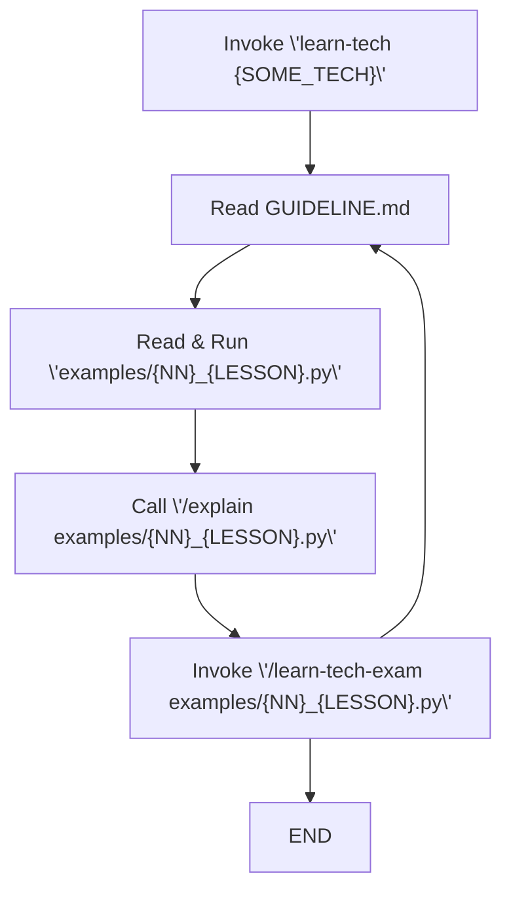

# ushenin-skill-collection

A personal collection of skills for learning and tinkering

**Fast Install:** Write in you harness `Install all skills from the repo: https://github.com/KonstantinUshenin/ushenin-skill-collection`

## Skills

**[/learn-tech](learn-tech/)** -- is a skill to learn some software technology via set of gradually complicated examples. Use it like `/learn-tech redis`, `/learn-tech kafka`, etc. This skill usually create 10-12 examples and all necessary infrastructure.

**[/learn-tech-exam](learn-tech-exam/)** -- oral examination on a technology topic. One question at a time, with feedback and gap analysis. Works best on a `/learn-tech` repo with `GUIDELINE.md`, `examples/` and other files.

## Study Guide

* Run `/learn-tech SOME_TECH` to create self-study guide for the technology
* Analyze each example one by one following `GUIDELINE.md` and content of `examples/` folder. 
* Use `/explain` or other command from your harness to better understand examples.
* Mutate, breake and fix the code for better understanding. Use your IDE's debug mode to inspect variables. 
* Run `/learn-tech-exam examples/{NN}_{LESSON}.py` to exam yourself and close gaps.
* One lesson with its exam usually takes 1–1.5 hours of real time. I do not recommend going faster.
* It is suitable to read `GUIDELINE.md` in GitHub web UI, Obsidian or other software for Markdown rendering.

## Install

**Option 1:** Write in you harness `Install all skills from the repo: https://github.com/KonstantinUshenin/ushenin-skill-collection`

**Option 2:** Clone this repo, then symlink each skill into the skills directory for your agent:

| Agent | Command |
|-------|---------|
| **Cursor** | `ln -s "$(pwd)/learn-tech" ~/.cursor/skills/learn-tech` |
| | `ln -s "$(pwd)/learn-tech-exam" ~/.cursor/skills/learn-tech-exam` |
| **Claude Code** | `ln -s "$(pwd)/learn-tech" ~/.claude/skills/learn-tech` |
| | `ln -s "$(pwd)/learn-tech-exam" ~/.claude/skills/learn-tech-exam` |
| **OpenClaw** | `ln -s "$(pwd)/learn-tech" ~/.openclaw/skills/learn-tech` |
| | `ln -s "$(pwd)/learn-tech-exam" ~/.openclaw/skills/learn-tech-exam` |
| **Hermes** | `ln -s "$(pwd)/learn-tech" ~/.hermes/skills/learn-tech` |
| | `ln -s "$(pwd)/learn-tech-exam" ~/.hermes/skills/learn-tech-exam` |
| **pi** | `ln -s "$(pwd)/learn-tech" ~/.pi/agent/skills/learn-tech` |
| | `ln -s "$(pwd)/learn-tech-exam" ~/.pi/agent/skills/learn-tech-exam` |

**Option 3:**  `openclaw skills install ./learn-tech --global` · `hermes skills install ./learn-tech`

## Note

This skills were originally designed for Cursor and Auto model selection.

**Version:** v0.0.2 — see [CHANGELOG.md](CHANGELOG.md)
